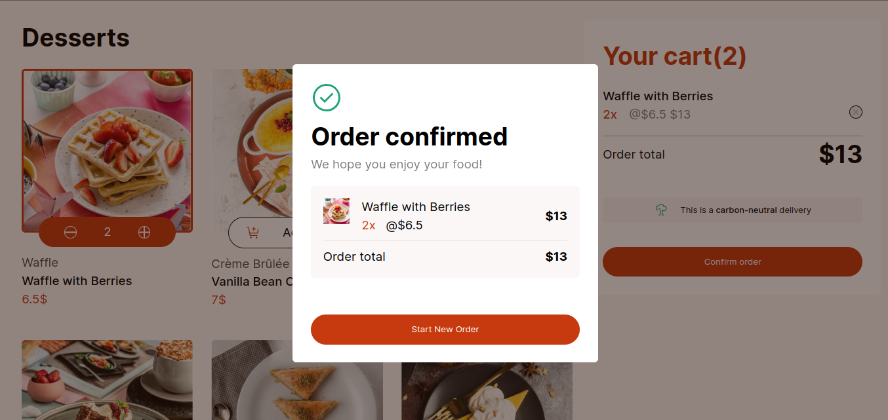

# Frontend Mentor - Product List with Cart Solution

This is a solution to the [Product list with cart challenge on Frontend Mentor](https://www.frontendmentor.io/challenges/product-list-with-cart-5MmqLVAp_d). Frontend Mentor challenges help you improve your coding skills by building realistic projects. 

## Overview

### The Challenge

The challenge was to create a responsive product list with a functional shopping cart using any JavaScript technology we are comfortable with. The primary goals were to ensure a great user experience on both desktop and mobile devices and to implement core e-commerce functionalities such as adding/removing items and updating quantities in the cart.

### Screenshot

### Links

- Solution URL: [Github](https://github.com/Dyma54/Frontend-Mentor---Product-List-with-Cart)
- Live Site URL: [Vercel](https://frontend-mentor-product-list-with-cart-three.vercel.app/)

## My Process

### Built With

- Semantic HTML5 markup for better accessibility and SEO
- SCSS Modules for modular and maintainable styling
- Flexbox for creating flexible layouts
- CSS Grid for complex and responsive grid layouts
- Mobile-first workflow ensuring a great user experience on all devices
- [React](https://reactjs.org/) - A JavaScript library for building user interfaces, leveraging components for a dynamic user experience
- [Vite](https://vitejs.dev/) for fast and efficient building

### What I Learned

In this project, I gained valuable insights into several key concepts:

**The Power of the useContext Hook:** This hook allowed me to share states like quantities and prices between components without prop drilling, simplifying state management.

**Responsive Design Techniques:** I improved my skills in responsive design using CSS Grid, Flexbox, and media queries, ensuring a seamless experience across different devices.

**Applying the DRY Principle:** I consistently applied the DRY principle to create reusable components, which enhanced maintainability in both the cart list and confirm order functionalities.

**Using createPortal:** I learned how to use `createPortal` to create popups, like the confirmation modal that appears when clicking the "Confirm Order" button, ensuring timely feedback for users.

**Project Setup:** I learned how important it is to set up a project correctly for maintainability.

### Continued Development

In the future, I plan to integrate React Router DOM for seamless navigation across different pages. I also aim to add a user authentication system, inviting users to log in or create an account before performing actions like confirming an order. Additionally, I plan to manage user cookies to store their data for future visits. Furthermore, I intend to build a backend for this project. The goal is to notify the admin (me) when a user places an order and to store the user’s data in a database, including their name, the products they ordered, and other relevant information.

### Useful Resources

- **PropTypes:** This allowed me to define types for my components' props, ensuring type safety and better documentation.

## Author

- Website - [KABORE Mady alias Dyma](https://github.com/Dyma54)
- Frontend Mentor - [@Dyma54](https://www.frontendmentor.io/profile/Dyma54)
- Twitter - [@Dyma226](https://x.com/Dyma226)